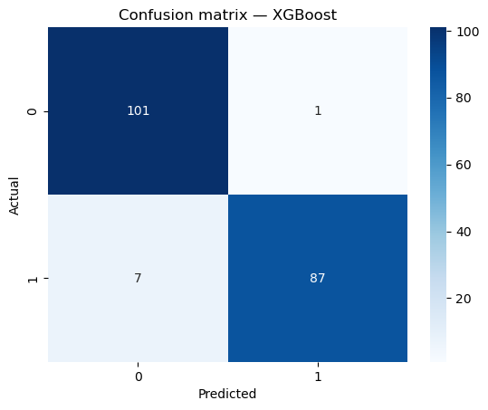
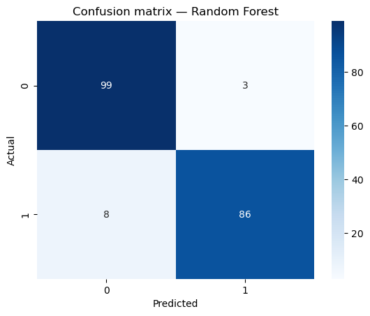

# SSTI-ML-Detect

**Machine learning-based detection of Server-Side Template Injection (SSTI) payloads using interpretable lexical, structural, and semantic features.**


---

## Overview

Server-Side Template Injection (SSTI) lets an attacker inject template syntax into a web application that the server's template engine then evaluates, often escalating to remote code execution. Signature and regex-based detectors are precise against known payloads but degrade quickly against obfuscation and unseen delimiter variants.

This project asks a different question: **can a classifier trained on interpretable features of a payload string generalize better than a fixed signature list?** It builds a full pipeline — feature engineering, model training/tuning, and evaluation — for classifying SSTI attack payloads against benign input, engine-agnostically (Jinja2/Twig/Handlebars, Freemarker/Thymeleaf/Mako, Velocity, OGNL/Struts).

## Key Results

Seven classifiers were tuned (RandomizedSearchCV, stratified CV) and evaluated on a held-out test split (196 payloads):

| Model | Accuracy | Macro F1 | ROC-AUC |
|---|---|---|---|
| Naive Bayes | 0.79 | 0.77 | 0.907 |
| Logistic Regression | 0.92 | 0.92 | 0.945 |
| K-Nearest Neighbors | 0.89 | 0.89 | 0.937 |
| Support Vector Machine | 0.92 | 0.92 | 0.958 |
| Decision Tree | 0.93 | 0.93 | 0.962 |
| Random Forest | 0.94 | 0.94 | **0.981** |
| **XGBoost** | **0.96** | **0.96** | 0.965 |

XGBoost wins on accuracy/F1; Random Forest produces the best-calibrated ranking (highest ROC-AUC). See [`results/`](results/) for confusion matrices and the full metrics table.

<p align="center">
  
  
</p>

## Feature Set

977 labeled payloads (477 SSTI, 500 benign) are vectorized into **17 features** across three interpretable groups, so classification performance can be attributed to genuine signal rather than a single dominant feature:

| Group | What it captures | Examples |
|---|---|---|
| **Lexical** | Statistical shape of the string | `payload_length`, `special_char_ratio` |
| **Structural** | Delimiter surface across engines | `count_double_brace`, `delimiter_family_count`, `max_bracket_depth` |
| **Semantic** | Attacker intent + evasion | `has_dunder_chain`, `has_exec_tokens`, `has_java_reflection`, `has_string_operation` |

Full feature definitions and regex rationale: [`src/feature_extraction.py`](src/feature_extraction.py).

## Project Structure

```
ssti-ml-detection/
├── data/
│   ├── raw/                  # ssti_payloads.txt, benign_payloads.txt (one payload per line)
│   └── processed/            # ssti_features_all.csv (977 x 17 feature matrix + label)
├── src/
│   ├── feature_extraction.py       # 17-feature extractor (the core contribution)
│   ├── extract_to_csv.py           # CLI: payloads.txt -> features.csv
│   └── cross_validation_analysis.py  # 5-fold CV + feature-importance-by-group analysis
├── notebooks/
│   └── model_training_and_evaluation.ipynb   # training, tuning, single-split evaluation
├── results/
│   ├── figures/               # confusion matrices for all 7 models
│   └── metrics_summary.csv    # single-split performance table
└── requirements.txt
```

## Installation

```bash
git clone https://github.com/omarwhadidi/SSTI-detection-using-ML.git
cd SSTI-detection-using-ML
pip install -r requirements.txt
```

## Usage

**Extract features from a new payload list:**
```bash
cd src
python extract_to_csv.py ../data/raw/ssti_payloads.txt --label 1 -o ssti_feats.csv
python extract_to_csv.py ../data/raw/benign_payloads.txt --label 0 -o benign_feats.csv
```

**Reproduce model training and single-split evaluation:**
```bash
jupyter notebook notebooks/model_training_and_evaluation.ipynb
```

**Run 5-fold cross-validation + feature-importance-by-group analysis:**
```bash
cd src
python cross_validation_analysis.py
```

## Methodology

1. **Dataset** — 977 payloads spanning multiple template-engine delimiter families (SSTI) and representative benign strings, including template-like text that superficially resembles SSTI syntax without being an attack.
2. **Feature engineering** — every payload is mapped to a fixed 17-dimensional vector; only `payload_length` is standardized (fit on train, applied to test).
3. **Models** — Naive Bayes, Logistic Regression, Decision Tree, KNN, SVM (RBF), Random Forest, XGBoost — all tuned via `RandomizedSearchCV` optimizing macro-F1 under 3-fold stratified CV.
4. **Evaluation** — accuracy, macro-F1, and ROC-AUC on an 80/20 held-out split, cross-checked with 5-fold stratified CV and feature-importance analysis aggregated by semantic group.

## Limitations & Future Work

- Dataset size is modest (977 payloads) and benign examples were authored, not sampled from production traffic.
- Hyperparameters were reused across CV folds rather than nested-CV tuned — an optimistic-bias risk to address before any operational claim.
- No adversarial evaluation yet against an attacker with knowledge of the feature set.
- Planned: obfuscated/evasive payload augmentation, nested CV with confidence intervals, adversarial robustness testing.

## License

MIT — see [LICENSE](LICENSE).

## Contact

Omar Walid Elhadidi — [omarwhadidi9@gmail.com](mailto:omarwhadidi9@gmail.com)

Built as part of a Master of Science in Cyber Security creative component, Iowa State University.
